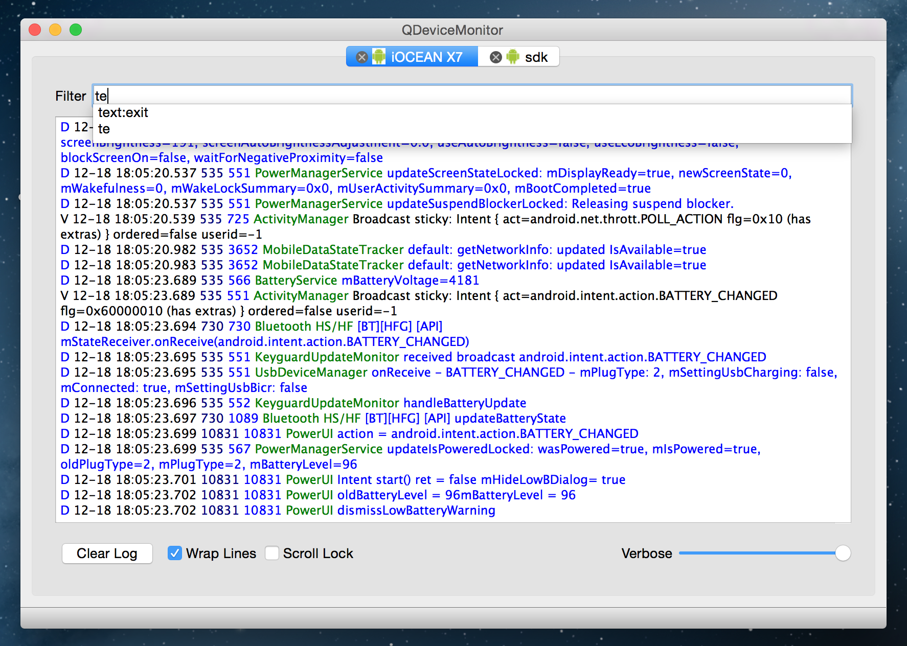

QDeviceMonitor
==============

[](https://travis-ci.org/alopatindev/qdevicemonitor)
[](https://ci.appveyor.com/project/alopatindev/qdevicemonitor)

Crossplatform log viewer for Android, iOS and text files.

Key Features
------------
1. GNU/Linux, Mac OS X and Windows support
2. Logs can be taken from Android, iOS or from text file
3. Filtering support
    1. Plain text, wildcards and regexes
    2. Prefixes **pid:, tid:, tag: or text:** (Android only)
    3. Verbosity level (Android only)
    4. Automatic filter history that is used as autocomplete
4. Backup to text files automatically. Automatic old files removal
5. Log color highlighting (two color schemes)
6. Shortcuts
    1. Alt+C — clear log
    2. Ctrl+M — add a mark to log
    3. Ctrl+E — open in external text editor



Installation
------------

### GNU/Linux
#### Ubuntu
1. Add **universe** repository (Software Center — Edit — Software Sources...)
2. sudo add-apt-repository --yes ppa:ubuntu-sdk-team/ppa
3. sudo apt-get update
4. [Download](https://sourceforge.net/projects/qdevicemonitor/files/ci/ubuntu/) and install the last deb package

#### Gentoo
[Use ebuild](https://bugs.gentoo.org/show_bug.cgi?id=532898) from Gentoo's Bugzilla.

### Mac OS X
[Download](https://sourceforge.net/projects/qdevicemonitor/files/ci/osx/), unzip and move the app to /Applications.

### Windows
1. If you need Android support (optional)
    1. Install Android SDK
    2. Install **Tools**, **Platform-tools** and **USB Driver** with Android SDK manager
    3. Add the path to `platform-tools` directory (from Android SDK) to **Path** environment variable (with Control Panel — System — Advanced — Environment Variables)
2. [Download](https://ci.appveyor.com/project/alopatindev/qdevicemonitor/build/artifacts), unzip and run.
Full build list is [here](https://ci.appveyor.com/project/alopatindev/qdevicemonitor/history).

### Build from the Source Code
Make sure that you have installed [Qt >= 5](http://www.qt.io/download-open-source).
* open **qdevicemonitor/qdevicemonitor.pro** with QtCreator and build the project
* **or** use the following terminal commands:
```
cd qdevicemonitor
qmake
make -j8
```

Troubleshooting
---------------

### iOS devices are not recognized?
Make sure that you've confirmed (from the device) that you trust this computer.

#### on GNU/Linux
If you've just installed **usbmuxd** (as dependence) it probably didn't run
automatically as you plugged in the device.
If so—try **udevadm control --reload** or run usbmuxd manually.

#### on Windows
Make sure you've installed [iTunes](https://www.apple.com/itunes/download/)
and checked that it runs and detects your device.

### Android devices are not recognized?
1. Make sure you've enabled Developer mode on your device (basically with Settings — Developer Options — USB Debugging)
2. Make sure you've confirmed (from the device) you trust your computer
3. Make sure your device is detectable with ddms/monitor
    1. On some devices debugging works only if you select the particular "Connect as" option (Built-in CD-ROM, Camera, MTP, etc.)
    2. Try "adb kill-server" and "adb devices" commands

#### on GNU/Linux
1. Check the Vendor ID of your device with `lsusb`
2. Create or modify the file `~/.android/adb_usb.ini`. Add a line (with the content "0x1234", where `1234` should be replaced with your Vendor ID) to the beginning or end of the file
3. Create or modify the file /etc/udev/rules.d/51-android.rules
4. Modify the file permission: `sudo chmod a+rx /etc/udev/rules.d/51-android.rules`
5. Add a line (with the following content) to the file: `SUBSYSTEM=="usb", ATTR{idVendor}=="1234", MODE="0666", GROUP="plugdev"` where `1234` should be replaced with your Vendor ID
6. Ensure that you are in the user group "plugdev": `sudo adduser plugdev`
7. Restart the udev service: `sudo service udev restart`
8. `adb kill-server && adb devices`

#### on Windows
1. If your device is not detectable with ddms/monitor
    1. Check Control Panel — System — Hardware — Device Manager: is your device detected correctly? If it's not—try reinstalling the driver specifying the path to `extras\google\usb-driver` (from Android SDK)
    2. If it didn't work—try reinstalling the driving by choosing "Don't search. I will choose the driver to install" and select "Android Composite ADB Interface"
2. Make sure you've added a path to `platform-tools` directory (from Android SDK) to **Path** environment variable
3. Try to restart the OS

If you're still experiencing issues—try all troubleshooting steps from the beginning (probably you've configured everything right and reapplying one of the previous steps will work). If it didn't help—try to Google it, I'm pretty sure you're running into some common issue ;)

License
-------

This program is free software: you can redistribute it and/or modify
it under the terms of the GNU General Public License as published by
the Free Software Foundation, either version 3 of the License, or (at
your option) any later version.

This program comes with ABSOLUTELY NO WARRANTY.
This is free software, and you are welcome to redistribute it
under certain conditions; read LICENSE for details.

Copyright (C) 2014—2015  Alexander Lopatin <alopatindev ät gmail dot com>
