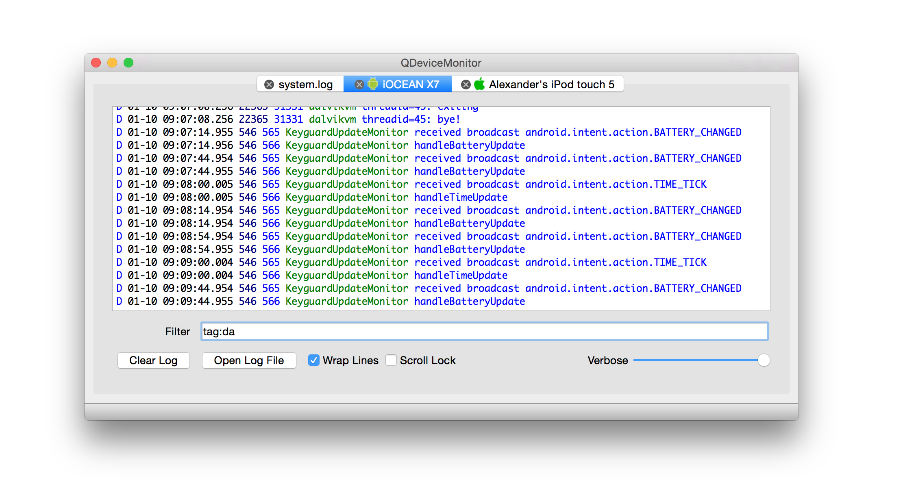

QDeviceMonitor
==============

[](https://github.com/alopatindev/qdevicemonitor/releases/latest)
[](https://travis-ci.org/alopatindev/qdevicemonitor)
[](https://ci.appveyor.com/project/alopatindev/qdevicemonitor/build/artifacts)
[](https://isocpp.org)
[](https://en.wikipedia.org/wiki/C11_(C_standard_revision))

Crossplatform log viewer for Android, iOS and text files.

Key Features
------------
1. GNU/Linux, Mac OS X and Windows support
2. Logs can be taken from Android, iOS or from text file
3. Filtering support (RegExp)
    1. Automatic filter history that is used as autocomplete
    2. Prefixes **pid:, tid:, tag: or text:** (Android only)
4. Verbosity level (Android only)
5. Backup to text files automatically. Automatic old files removal
6. Color Highlight (two color schemes)
7. Clear Log
8. Add a Mark to Log
9. Open Log in External Text Editor



Installation
------------

### GNU/Linux
#### Ubuntu
1. Add **universe** repository (Software Center — Edit — Software Sources...)
2. `sudo add-apt-repository --yes ppa:ubuntu-sdk-team/ppa`
3. `sudo apt-get update`
4. Install the .deb

#### Gentoo
[Use .ebuild](https://bugs.gentoo.org/show_bug.cgi?id=532898) from Gentoo's Bugzilla

### Mac OS X
Open the .dmg and move the app to /Applications

### Windows
1. For Android support
    1. Install Android SDK
    2. Install **Tools**, **Platform-tools** and **USB Driver** with Android SDK manager
    3. Add the path to `platform-tools` directory (from Android SDK) to **Path** environment variable (with Control Panel — System — Advanced — Environment Variables)
2. Unpack the .zip and run `qdevicemonitor.exe`

## Latest (Unstable) Builds

[](https://sourceforge.net/projects/qdevicemonitor/files/ci/ubuntu/)
[](https://sourceforge.net/projects/qdevicemonitor/files/ci/osx/)
[](https://ci.appveyor.com/project/alopatindev/qdevicemonitor/build/artifacts)

### Build from the Source Code
Make sure that you have installed [Qt >= 5.6](http://www.qt.io/download-open-source)
* open `qdevicemonitor/qdevicemonitor.pro` with QtCreator and build the project
* **or** use the following terminal commands:
```
cd qdevicemonitor
qmake
make -j8
```

Troubleshooting
---------------
Check [TROUBLESHOOTING.md](TROUBLESHOOTING.md)

License
-------

This program is free software: you can redistribute it and/or modify
it under the terms of the GNU General Public License as published by
the Free Software Foundation, either version 3 of the License, or (at
your option) any later version.

This program comes with ABSOLUTELY NO WARRANTY.
This is free software, and you are welcome to redistribute it
under certain conditions; read LICENSE for details.

Copyright (C) 2014—2016  Alexander Lopatin <alopatindev ät gmail dot com>
